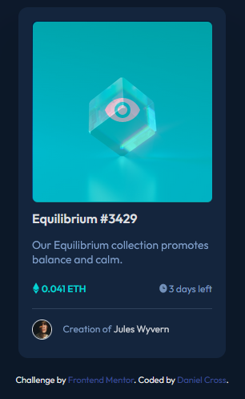

# Frontend Mentor - NFT preview card component solution

This is a solution to the [NFT preview card component challenge on Frontend Mentor](https://www.frontendmentor.io/challenges/nft-preview-card-component-SbdUL_w0U). Frontend Mentor challenges help you improve your coding skills by building realistic projects. 

## Table of contents

- [Overview](#overview)
  - [The challenge](#the-challenge)
  - [Screenshot](#screenshot)
  - [Links](#links)
- [My process](#my-process)
  - [Built with](#built-with)
  - [What I learned](#what-i-learned)
  - [Continued development](#continued-development)
  - [Useful resources](#useful-resources)
- [Author](#author)
- [Acknowledgments](#acknowledgments)


## Overview

### The challenge

Users should be able to:

- View the optimal layout depending on their device's screen size
- See hover states for interactive elements

### Screenshot




### Links

- Solution URL: [https://github.com/DanWinCross/nft-preview-component](https://github.com/DanWinCross/nft-preview-component)
- Live Site URL: [ https://danwincross.github.io/nft-preview-component/]( https://danwincross.github.io/nft-preview-component/)

## My process

### Built with

- Semantic HTML5 markup
- CSS custom properties
- Flexbox
- CSS Grid
- Mobile-first workflow


### What I learned

I learned how to really pay attention to detail in this project. I think I did well when it comes to the majority of my sizing and positioning. There were still some areas which I found challenging as the elements did not move in the way I intended them to. 

I also learned some more valuable information on how to use absolute and relative positioning during active states. 

To see how you can add code snippets, see below:

```html
<h1>Some HTML code I'm proud of</h1>
```
```css
.overlay{
    transition: .5s ease;
    opacity: 0;
    position: absolute;
    top: 50%;
    left: 50%;
    transform: translate(-50%, -50%);
    -ms-transform: translate(-50%, -50%);
    text-align: center;
    background-color: var(--cyan);
    padding: 86px 88px;
    border-radius: 6px;
}

.image-container:active .overlay{
    opacity: 0.6;
}
```


### Continued development

I would like to learn how to manipulate elements better when using CSS flexbox. I tried to seperate two divs with "justify-content: space-between;", but it just didn't work. I'd like to master these spacific aspects so that I can do projects like this with more ease. 

Something else I'd like to practice more is tranforming an active state with more detail. I could not get the image icon to be opaque while it's background was more translucent. 


### Useful resources

- [https://www.w3schools.com/default.asp](https://www.w3schools.com/default.asp) - This helped me with my active state and posotioning. 

## Author

- Website - [Daniel Cross](https://github.com/DanWinCross/nft-preview-component)
- Frontend Mentor - [@DanWinCross](https://www.frontendmentor.io/profile/DanWinCross)


